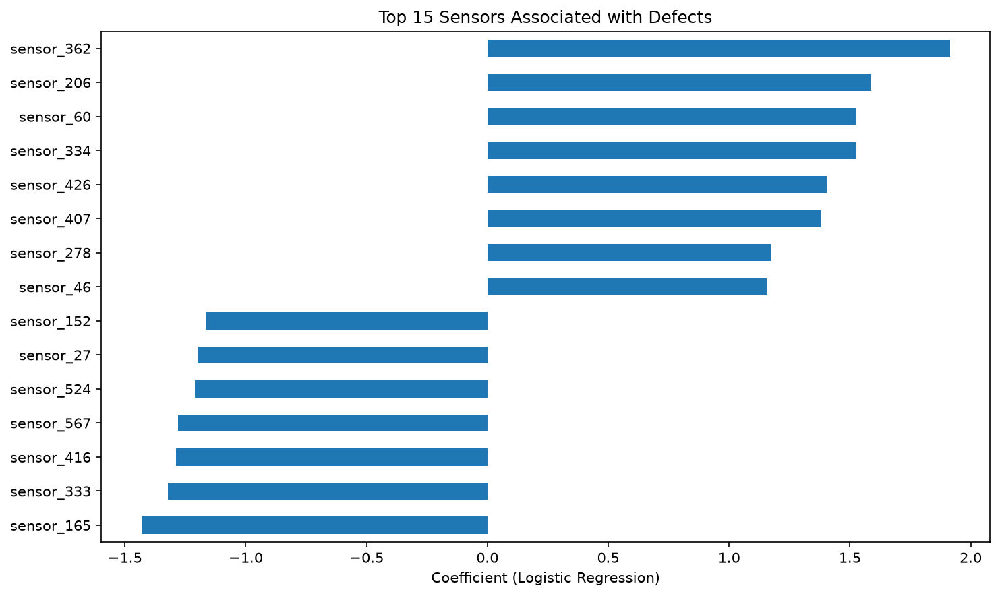
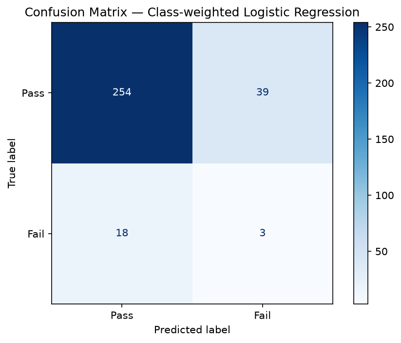

# Manufacturing Quality Defect Classification (SECOM)

## Problem Statement
In high-volume manufacturing, catching defective units before they ship is critical — but inspecting every unit on every sensor reading manually doesn't scale. This project builds a classifier to predict pass/fail outcomes from semiconductor manufacturing process sensor data, applying a Six Sigma "reduce variation, catch defects early" lens through a machine learning workflow.

## Dataset
[SECOM Dataset (UCI Machine Learning Repository)](https://archive.ics.uci.edu/dataset/179/secom) — real semiconductor manufacturing process data.
- 590 anonymized sensor/process measurement features per unit
- Binary label: pass (-1) / fail (1)
- Known challenge: severe class imbalance (~7% failure rate) and many features with missing or near-constant values

## Approach
1. **Exploratory Data Analysis** — missing value patterns, class imbalance visualization, feature distributions
2. **Feature Reduction** — drop near-zero-variance features, handle missing values, correlation filtering (590 raw features is too many to model naively)
3. **Handling Class Imbalance** — class weighting and/or SMOTE, since a naive model could get ~93% "accuracy" by just predicting every unit passes
4. **Modeling** — baseline Logistic Regression → Random Forest / XGBoost with class balancing
5. **Evaluation** — precision, recall, F1, and confusion matrix (NOT plain accuracy — misleading on imbalanced data)
6. **Feature Importance** — which process variables are most associated with defects

## Results

Class imbalance made this a non-trivial classification problem — only 6.6% of units failed. A naive model predicting "pass" every time would score 93% accuracy while catching zero defects.

| Model | Fail Precision | Fail Recall | Fail F1 |
|---|---|---|---|
| Logistic Regression (unweighted baseline) | 0.10 | 0.05 | 0.06 |
| Logistic Regression (class-weighted) | 0.88 | 0.82 | 0.85 |
| Random Forest (class-weighted) | 0.00 | 0.00 | 0.00 |
| Random Forest + SMOTE | 0.33 | 0.05 | 0.08 |

**Key findings:**
- Reduced feature space from 590 to 297 sensors by removing high-missing-value and near-zero-variance columns.
- Plain accuracy is misleading on this dataset: the unweighted baseline hit 91% accuracy while catching only 5% of actual defects.
- Class-weighted Logistic Regression was the strongest model by a wide margin, improving Fail recall from 5% to 82%.
- Random Forest, with or without SMOTE oversampling, underperformed Logistic Regression on this dataset — a reminder that more complex models don't always win, especially on small, high-dimensional, imbalanced data.




**Interpretation:** In a quality control context, missing a real defect (false negative) is typically far costlier than a false alarm (false positive). This project prioritized recall on the Fail class accordingly — the same logic Six Sigma practitioners apply when weighing inspection sensitivity against cost.

## Why This Project
This project mirrors real quality control work: distinguishing signal from 590 noisy process variables, respecting that false negatives (missed defects) and false positives (false alarms) carry very different costs — a tradeoff Six Sigma practitioners navigate constantly, now framed as a precision/recall decision.

## Repo Structure
```
quality-defect-classifier/
├── data/           # raw and processed data (not committed; see data/README)
├── notebooks/       # exploratory analysis and modeling notebooks
├── src/             # reusable Python scripts (data loading, preprocessing, modeling)
├── outputs/          # saved figures, model artifacts, results tables
├── requirements.txt
└── README.md
```

## Tools
Python, pandas, NumPy, scikit-learn, imbalanced-learn (SMOTE), XGBoost, matplotlib/seaborn, Jupyter
